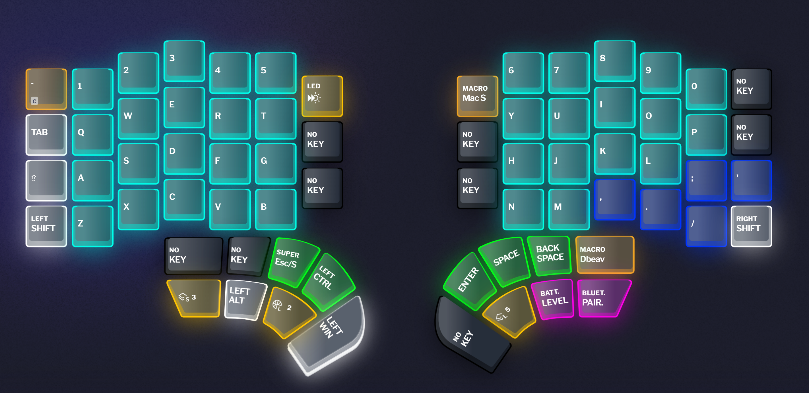
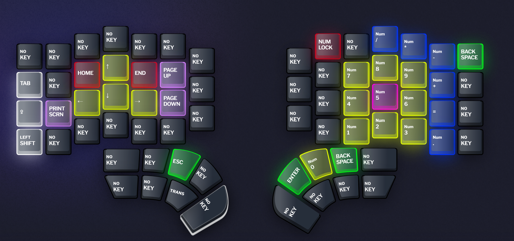
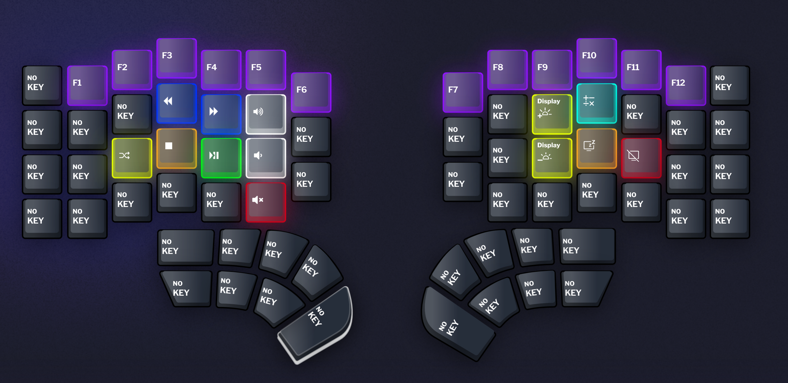
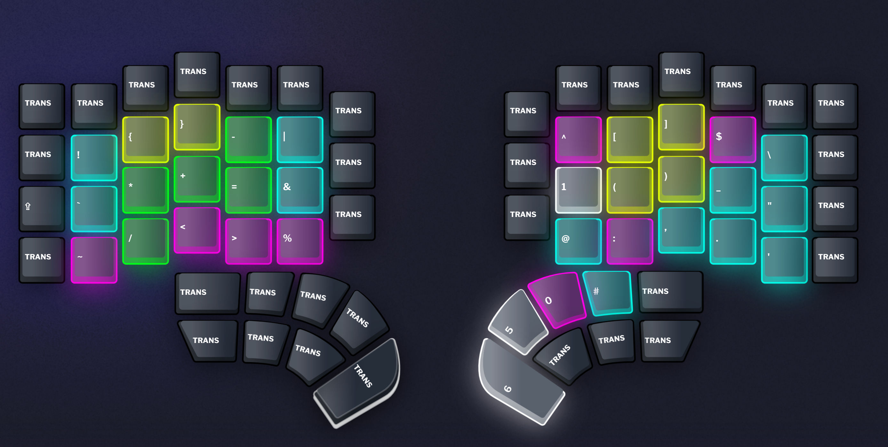
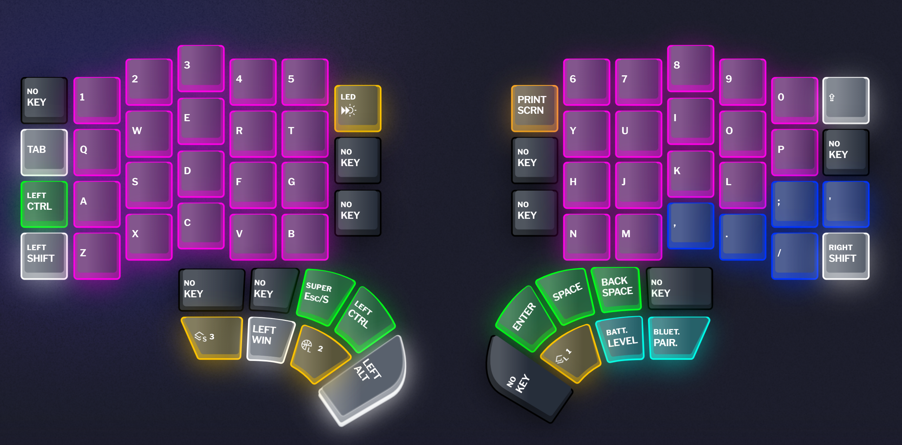

# Dygma Defy Configuration

This repo contains my personal configuration for the Dygma Defy keyboard. See below
for further details on each layer.

## Layers

<strong>L1 - macOS Layer </strong>

Layer containing macOS specific shortcuts (e.g screenshots/cycle between windows
of similar application types) and macOS specific macros for programs like
DBeaver. Thumb clusters are configured with commonly used vim keys in mind.

Note: Keys are currently configured with Windows keys which is not ideal. This
is a result of configuring the Defy via Bazecor on a Windows machine

<strong>L2 - Numpad Layer </strong>

Layer with numpad and arrow keys

<strong>L3 - Functions and Media Layer </strong>

Layer containing a lightly modified version of the default functions/media
layer.

<strong>L4 - Symbols Layer </strong>

Layer containing a more ergonomic configuration for commonly used programming
symbols. This configuration is set up with mainly Python, SQL, shell commands,
and commonly-used vim keys in mind.

Inspired originally from [Pascal Getreuer's symbol layer](https://getreuer.info/posts/keyboards/symbol-layer/index.html)

<strong>L5 - Windows Layer </strong>

Layer containing configuration for a Windows machine. This layer is similar
to the macOS layer apart from Windows-specific shortcuts and keys.

